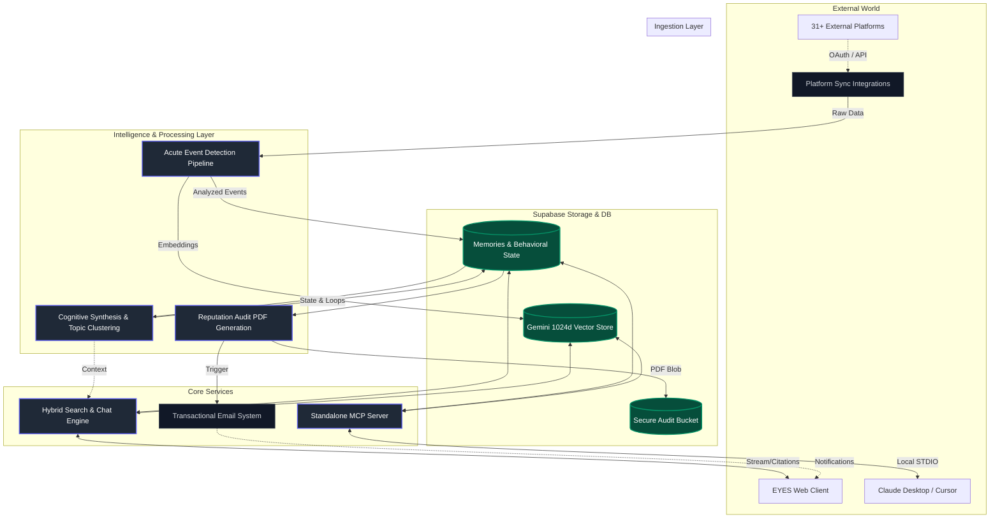

# EYES System Architecture

```mermaid
graph TD
    %% External Interfaces
    subgraph "External World"
        P[31+ External Platforms] -.->|OAuth / API| Sync
        UI[EYES Web Client]
        IDE[Claude Desktop / Cursor]
    end

    %% Ingestion & Processing Layers
    subgraph "Ingestion Layer"
        Sync[Platform Sync Integrations]
    end

    subgraph "Intelligence & Processing Layer"
        Acute[Acute Event Detection Pipeline]
        CogSyn[Cognitive Synthesis & Topic Clustering]
        AuditGen[Reputation Audit PDF Generation]
    end

    %% Storage Layer
    subgraph "Supabase Storage & DB"
        DB[(Memories & Behavioral State)]
        VS[(Gemini 1024d Vector Store)]
        PDFB[(Secure Audit Bucket)]
    end

    %% Access & Services Layer
    subgraph "Core Services"
        Chat[Hybrid Search & Chat Engine]
        Email[Transactional Email System]
        MCP[Standalone MCP Server]
    end

    %% Data Flow Connections
    Sync -->|Raw Data| Acute
    Acute -->|Analyzed Events| DB
    Acute -->|Embeddings| VS
    
    DB --> CogSyn
    CogSyn -->|State & Loops| DB
    
    DB --> AuditGen
    AuditGen -->|PDF Blob| PDFB
    AuditGen -->|Trigger| Email
    
    DB <--> Chat
    VS <--> Chat
    CogSyn -.->|Context| Chat
    
    DB <--> MCP
    VS <--> MCP

    %% User Interfaces Flow
    Chat <-->|Stream/Citations| UI
    MCP <-->|Local STDIO| IDE
    Email -.->|Notifications| UI
    
    %% Styling
    classDef primary fill:#1f2937,stroke:#6366f1,stroke-width:2px,color:#fff;
    classDef secondary fill:#111827,stroke:#374151,stroke-width:1px,color:#d1d5db;
    classDef database fill:#064e3b,stroke:#059669,stroke-width:2px,color:#fff;
    
    class Chat,Acute,CogSyn,AuditGen,MCP primary;
    class Sync,Email secondary;
    class DB,VS,PDFB database;
```
