# DETAILED PROJECT REPORT (DPR): THE EYES NEURAL MEMORY OS

**Date:** June 15, 2026  
**Document Version:** 1.0 (Developer Beta Core Audit & Handover)  
**Classification:** Confidential — Internal & Client Review  
**Project Owner:** Technical Integration & Architecture Team  

---

## 1. Executive System Summary

**The EYES** (Everything You Ever Said) is an AI-powered Neural Memory OS designed to ingest, index, and analyze personal digital footprint telemetry across connected productivity, development, and social platforms. By unifying communication logs into a privacy-guarded semantic index, the platform provides:
1. **Conversational Digital Memory Retrieval**: Seamless semantic lookup across all connected platforms via a natural language chat interface.
2. **Commitment & Reputation Auditing**: Diligence-grade diagnostics that assess reliability, trace follow-through on verbal and written promises, and highlight behavioral stress loops.

### System Pipeline Architecture

```mermaid
graph TD
    subgraph Data Ingestion & Sync
        A[Gmail / Slack / GitHub Connectors] -->|OAuth Tokens / Sync cursor| B[Platform Sync Route]
        B -->|Check Ingestion Lock| C{Active Audit?}
        C -->|Yes: Paused| D[Sync Blocked]
        C -->|No| E[Apply Privacy Exclusions]
        E -->|Drop Excluded Senders| F[Extract Content / PII / Risk Scorer]
        F -->|Upsert Raw events| G[(memories Table)]
        G -->|Trigger| H[Action Queue / Resend Notifications]
    end

    subgraph Retrieval & AI Gateway
        I[User Turn / Chat Route] -->|Conversational Core| J[Retrieval Planner]
        J -->|Generate Intents| K[LiteLLM AI Gateway]
        K -->|Fallback Pathway| L[Groq / OpenRouter / Gemini REST]
        K -->|Embeddings| M[Voyage AI / Gemini REST]
        M -->|1024-dim Vector| N[(memories Table Vector Search)]
        N -->|Hybrid Search Cosine + FTS| O[Evidence Block]
        O -->|System Prompt Persona| P[Grounded Response]
        P -->|Telemetrics| Q[(query_behavior Table)]
    end

    subgraph Reputation Auditing
        R[Audit Trigger] -->|AuditAnalysisService| S[Smart Selection & Sampling]
        S -->|Limit to 60 high-signal records| T[Batched Extraction]
        T -->|Verbatim promises| U[Commitment Ledger]
        U -->|Reconciliation| V{Calendar overlapping keywords & date window}
        V -->|Verify| W[Resolved Commitments]
        W -->|Score & Consistency Check| X[Finalized Audit Record]
        X -->|Write Report| Y[(reputation_audits Table)]
    end
```

---

## 2. Core Technical Pillars & Subsystems

### A. AI Model Orchestration & Gateway Routing (AI Gateway)
The cognitive engine of The EYES is routed through a unified AI gateway abstraction to ensure high availability, cost efficiency, and zero direct provider dependencies in the client application code.

*   **Primary Gateway (LiteLLM)**: Governed by the `LITELLM_BASE_URL` and `LITELLM_KEY` environment variables. All requests are routed through a single OpenAI-compatible fetch client.
*   **Model Aliases**: Literal model strings (e.g., `gpt-4o`, `claude-3-5-sonnet`) are strictly prohibited in application code. Instead, four standardized capability-based aliases are used:
    - `auto-chat` (conversational memory interaction)
    - `auto-extract` (finding entities, tasks, and commitments)
    - `auto-classify` (user intent profiling and metadata classification)
    - `auto-embed` (vector generation, standardized at 1024 dimensions)
*   **Fallback Paths**:
    - **Chat/Reasoning**: LiteLLM Gateway $\rightarrow$ Groq API (using rotating keys and token sizing safeguards) $\rightarrow$ OpenRouter API (free tier model pool) $\rightarrow$ Gemini REST API.
    - **Embeddings**: LiteLLM Gateway $\rightarrow$ Gemini REST API (`text-embedding-004`).
*   **Circuit Breakers**: Implements a 5-minute per-model in-process cooldown (`cooldowns` Map) that automatically bypasses endpoints experiencing high latency, rate limits (HTTP 429), or internal errors.
*   **Mock Mode**: Setting `MOCK_MODE=true` serves cached high-signal fixtures, bypassing external API calls during testing.
*   **Telemetry Privacy**: User behavioral queries in the `query_behavior` log are anonymized using a SHA-256 hash combined with a server-side `BEHAVIOR_SALT`, executing only if the user profile explicitly grants `behavior_logging_consent`.

### B. Reputation Audit & Commitment Ledger
The reputation auditing pipeline (`AuditAnalysisService.runAnalysis`) translates raw digital records into structured, audit-ready reports.

*   **Pipeline Stages**: Operates sequentially through six stages: `aggregate` $\rightarrow$ `filter` $\rightarrow$ `extract` $\rightarrow$ `cross-ref` $\rightarrow$ `score` $\rightarrow$ `synth`.
*   **Specialized Lenses**: Audits are dynamically generated using metadata filters tailored for specific business scenarios:
    - `full`: 360-degree composite review covering all dimensions.
    - `reputation`: Investor-facing due-diligence report focusing on follow-through and public credibility.
    - `behavioral`: Introspective coaching report highlighting personal communication patterns and stress loops.
    - `hiring`: HR-compliant candidate profile assessing reliability and team collaboration.
*   **Smart Selection & Sampling**: To work within LLM context limits and avoid noise, the engine selects exactly **60 high-signal records** combining:
    1. *Keyword Pre-filter*: Captures records containing commitments, deadlines, or project delivery words.
    2. *Recent Records*: Captures the last 30 days of active digital history.
    3. *Platform Samples*: Ensures representation from each connected integration (e.g., Slack, GitHub, Gmail).
    4. *Longitudinal Historical Samples*: Evenly spaced historical samples to capture long-term baseline behavior.
*   **Batched Extraction**: Parallelizes analysis by splitting the 60 selected records into sequential batches of 20. This isolates pipeline failures and avoids API payload limits.
*   **Calendar Reconciliation**: Automatically verifies commitments against Google Calendar events. A commitment is resolved as `completed` if a calendar event exists within 7 days of the commitment date and shares overlapping keywords. Otherwise, it remains `pending`.
*   **Score and Finding Consistency Check**: Programmatically prevents logical discrepancies where an audit returns a non-zero risk score but has an empty array of risk findings. If zero risks are found, the score is forced to `0.0`.

### C. Data Ingestion & Synchronization
*   **Data Ingestion Lock**: Pauses ingestion when an audit is active (`pending`, `analysis`, or `generating` status). This locks the database state to ensure snapshot integrity and prevent data mutations during scoring.
*   **Sync Depth Governance**: Governs chronological scan ranges based on settings: `shallow` (30 days), `balanced` (180 days), and `deep` (full history).
*   **Rate Limit Protection**: Implements chunking and throttle sleep cycles (e.g., 800ms between Google API fetches) to respect API quotas, combined with exponential backoff on retryable HTTP failures.
*   **Action Extraction Loop**: Gmail and Slack sync runs trigger a background action-extraction parser. New, high-confidence commitments or action items (e.g., draft email replies) write to the `action_queue` and dispatch notification emails to users via Resend for manual approval.

### D. Database Architecture & Vector Search
The database layer is hosted on Supabase PostgreSQL, structured across 48+ migrations to optimize retrieval speed and scale.

*   **Unified Memories Table**: Standardizes all external data (Gmail, Slack messages, Notion pages, etc.) in a unified `memories` table, including title, body content, timestamp, and a `vector(1024)` representation.
*   **1024-Dimension HNSW Indexing**: Accelerates semantic retrieval using an HNSW index configured with cosine operators (`vector_cosine_ops`), optimized for Voyage AI or Gemini embeddings.
*   **Hybrid Search RPC**: Merges semantic and keyword matching inside a single database query:
    - *Semantic Cosine Score*: Weighted at 0.7.
    - *FTS Keyword Rank* (`ts_rank_cd` over Websearch query): Weighted at 0.3.
    - Outputs a `combined_score` to return the most relevant context.
*   **Recovery and Monitoring Tables**: Handles async background syncs with robust system tables:
    - `sync_status`: Tracking current execution state and cursor offsets.
    - `sync_retry_queue`: Scheduled cron retries with backoff parameters.
    - `sync_retry_dead_letters`: Tracking persistent job failures after maximum retry attempts.
    - `oauth_refresh_logs`: Monitoring refresh success rates and HTTP responses.

### E. Privacy Shield & Exclusions
*   **Privacy Excludes Database**: The `privacy_excludes` table allows users to define custom exclusion rules at the connector and item levels (e.g., specific email addresses, Slack channels, Discord servers, and GitHub repositories).
*   **Active Sync Filtering**: During Gmail sync cycles, emails originating from senders registered in `connector_settings.data_types.excludedSenders` are dropped before reaching the database, preventing indexing.
*   **PII Masking**: Filters incoming chat messages and retrieved evidence blocks through regular-expression-based masking (`maskPII` in `chat/route.ts`), stripping credit card patterns, SSNs, and plain-text passwords.

---

## 3. Operational Readiness & Scaling Roadmap

The product is currently configured in **Phase 1: Developer Beta** (optimized for single-user/development testing) and is transitioning to **Phase 2: 100-User Production**.

### Phase Metrics Comparison

| Metric | Phase 1 (Developer Beta) | Phase 2 (100-User Production) | Required Upgrades |
| :--- | :--- | :--- | :--- |
| **Max Concurrent Users** | 1–3 users | 100 users | Paid provider subscriptions |
| **Sync Capacity** | 10 Users / Daily | 100 Users / Daily | Cron concurrency & plan upgrades |
| **Serverless Timeout** | 10s (Vercel Free) | 60s (Vercel Pro) | Vercel Pro Plan ($20/mo) |
| **Database Tier** | Free tier (Supabase) | Pro tier (Supabase) | Supabase Pro ($25/mo) |
| **AI API Limits** | Shared Free Keys (15 RPM) | Paid Accounts (2,000+ RPM) | Enabled billing on Google AI & OpenRouter |
| **Embeddings Key** | Free tier (Cohere/Gemini) | Production key | Move to production endpoint credits |

### Fixed & Variable Costs Analysis (100 Users)

#### 1. Fixed Infrastructure Costs ($45.00/mo)
*   **Vercel Pro**: **$20.00/month** (increases serverless timeout limits from 10s to 60s, which is critical for long-running sync routes).
*   **Supabase Pro**: **$25.00/month** (supports larger database sizes, vector indexing, backup cycles, and multi-tenant RLS query loads).

#### 2. Variable AI Costs (~$150.00 - $300.00/mo)
*   **Chat Reasoning (OpenRouter / Gemini)**: **~$1.00 - $2.50 per user/month** (assuming ~500 chat queries/interactions per user monthly).
*   **Embeddings Generation**: **~$0.20 - $0.50 per user/month** (assuming up to 10k synced communications/events per user monthly).
*   **Total Monthly cost per active user**: **~$1.95 - $3.45**.

> [!TIP]
> **Cost Reduction Strategy**: By setting `AI_CHAT_PREFERENCE="gemini"` and utilizing `gemini-2.0-flash`, the variable chat cost drops by nearly 60% compared to Claude 3.5 Sonnet, with negligible degradation in memory retrieval quality.

---

## 4. Open Technical Recommendations & Gaps

1.  **Transition to Direct Sync Execution**:
    - *Current State*: The cron sync handler (`/api/cron/sync`) calls sync endpoints over HTTP (`runPlatformSyncViaHttp`). While functional, it introduces Vercel edge runtime connection overhead and potential timeouts.
    - *Recommendation*: Implement the database-bypass stub `runPlatformSyncDirect` inside `src/services/sync/platform-sync.ts` to execute platform sync operations directly in the database context without HTTP wrapper hops.
2.  **Privacy Shield Database Integration**:
    - *Current State*: The system maintains a `privacy_excludes` database table (Migration `039`), but filters senders during sync using JSON metadata in `connector_settings`.
    - *Recommendation*: Refactor platform sync connectors to join directly against the `privacy_excludes` table to ensure a unified, centralized exclude manager for Slack channels, GitHub repos, and Gmail threads.
3.  **Vector Dimension Constraints**:
    - *Current State*: Migrations `032` standardizes embeddings to **1024 dimensions** for Voyage/Gemini. Swapping models in the future requires clearing the vector column to prevent length mismatch crashes.
    - *Recommendation*: Keep embeddings at 1024. If model switches occur, run a migration script resetting older vector values to `NULL` to trigger automated background re-embedding.

---

## 5. Compliance & Security Architecture

### A. GDPR & Data Sovereignty (The Kill Switch)
Users retain absolute sovereignty over their data. In addition to standard security configurations (AES-256 for data-at-rest, TLS 1.3 for data-in-transit, and Row-Level Security isolation), The EYES includes an automated **Kill Switch** in the account settings page.  
Triggering the Kill Switch triggers a cascading transactional delete that permanently purges:
*   User credential tokens and profile attributes.
*   Connected integration tokens and keys (`oauth_tokens`).
*   All user event logs, indexed communications, and search queries.
*   Generated vector embeddings in the neural index.

*This delete operates directly on database disks and is completely non-reversible.*

### B. California Notice at Collection (CCPA)
The EYES is CCPA compliant, ensuring that:
1. **No Data Sales**: User communications are never shared with advertising networks or data brokers.
2. **Enterprise AI Zero-Retention**: LLM interactions route through enterprise-grade channels ensuring that personal data is never used to train public generative models.
3. **Consumers Rights Support**: California residents can inspect, correct, limit processing of sensitive personal information, or trigger automated deletion at any time.

### C. Web Accessibility Conformance
The dashboard targets **WCAG 2.1 Level AA** standards:
*   **Full Keyboard Navigation**: All menus, inputs, and chat boxes support keyboard navigation with highly visible focus rings.
*   **Contrast Standards**: Color themes guarantee a text-to-background contrast ratio of at least 4.5:1.
*   **Reduced Motion**: Automatically simplifies transitions and turns off loading animations if the user has enabled OS-level reduced motion settings.

---
