# EYES Codebase Deep Analysis & Production Readiness Assessment

This document provides a forensic, engineering-grade architectural review, performance profile, security/compliance mapping, and integration analysis of **The EYES V1** system codebase.

---

## 1. Executive Architectural Overview & Subsystem Flows

The EYES is a personal telemetry aggregator and reputation intelligence gateway. It collects digital footprint data across productivity, messaging, development, and social platforms, processes the raw content through ingestion gates (privacy exclusions and RLS isolation), indexes it as vectorized memories, and exposes it to semantic chat retrieval and risk auditing.

```mermaid
graph TD
    subgraph Ingestion & Sync Pipelines
        A[Gmail / Slack / GitHub Connectors] -->|OAuth Tokens / Cursor| B[Platform Sync Route]
        B -->|Check Ingest Lock| C{Active Audit?}
        C -->|Yes: Paused| D[Sync Blocked]
        C -->|No| E[Apply Privacy Exclusions]
        E -->|Drop Excluded Senders| F[Extract Content / PII / Risk Scorer]
        F -->|Upsert Raw events| G[(memories Table)]
        G -->|Trigger| H[Action Queue / Resend Notifications]
    end

    subgraph Retrieval & AI Gateway
        I[User Turn / Chat Route] -->|Conversational Core| J[Retrieval Planner]
        J -->|Generate Intents| K[LiteLLM AI Gateway]
        K -->|Fallback Pathway| L[Groq / OpenRouter / Gemini REST]
        K -->|Embeddings| M[Voyage AI / Gemini REST]
        M -->|1024-dim Vector| N[(memories Table Vector Search)]
        N -->|Hybrid Search Cosine + FTS| O[Evidence Block]
        O -->|System Prompt Persona| P[Grounded Response]
        P -->|Telemetrics| Q[(query_behavior Table)]
    end

    subgraph Reputation Auditing
        R[Audit Trigger] -->|AuditAnalysisService| S[Smart Selection & Sampling]
        S -->|Limit to 60 high-signal records| T[Batched Extraction]
        T -->|Verbatim promises| U[Commitment Ledger]
        U -->|Reconciliation| V{Calendar overlapping keywords & date window}
        V -->|Verify| W[Resolved Commitments]
        W -->|Score & Consistency Check| X[Finalized Audit Record]
        X -->|Write Report| Y[(reputation_audits Table)]
    end
```



### Key Subsystem Component Mappings

1. **Ingestion Layer (`src/app/api/sync/*`)**:
   - Connector routes trigger OAuth-authenticated fetches against third-party endpoints.
   - Sync progress is maintained in `sync_status` to support incremental cursors.
   - Database mutations are routed through `upsertRawEventsSafely` ([`upsert.ts`](file:///e:/Projects/The%20EYES/src/utils/supabase/upsert.ts)) to map raw events into the unified `memories` table.

2. **AI Gateway (`src/services/ai/ai.ts`)**:
   - Unifies LLM calls through an OpenAI-compatible interface directed at `LITELLM_BASE_URL`.
   - Utilizes four code aliases: `auto-chat`, `auto-extract`, `auto-classify`, and `auto-embed`.
   - Implements automated fallback pipelines, cooldown circuit breakers (5-minute per-model cooldowns), and mock responses when `MOCK_MODE=true`.

3. **Reputation Auditing Engine (`src/services/audit/analysis-pipeline.ts`)**:
   - Manages the audit lifecycle (`aggregate` $\rightarrow$ `filter` $\rightarrow$ `extract` $\rightarrow$ `cross-ref` $\rightarrow$ `score` $\rightarrow$ `synth`).
   - Implements smart record selection to sample exactly 60 records for AI analysis out of thousands.
   - Cross-references commitments against Google Calendar events within 7 days using fuzzy keyword matches.

4. **PDF Booklet Generation (`src/services/audit/pdf-generator.ts`)**:
   - Streamed on-demand to the client using a Node.js-based PDFKit generator.
   - Formats a 9-page executive dossier containing risk score trajectories, PII listings, opportunity priority tables, and compliance indices.

---

## 2. Identified Technical Gaps & Codebase Mismatches

During the discovery phase, three key architectural gaps and bugs were identified. These must be resolved before proceeding with production deployment.

### Gap A: Embedding Dimension Mismatch (Critical Bug)
*   **Database Schema (`032_embedding_1024_voyage.sql`)**: Enforces a database column size of `vector(1024)` on the `memories.embedding` field, optimized for Voyage AI (`voyage-3`) or Gemini (`gemini-embedding-001`).
*   **AI Service File ([`ai.ts:L28`](file:///e:/Projects/The%20EYES/src/services/ai/ai.ts#L28))**: Hardcodes `EMBED_DIMS = 1536` for mock mode, stating: `const EMBED_DIMS = 1536; // Updated to 1536 for auto-embed OpenAI compatible`.
*   **Resulting Failure**: If the application runs in local development or test mode with `MOCK_MODE=true` against a real database instance, any background embedding cycle (`/api/sync/embeddings`) will trigger `mockResponse` which generates 1536-dimensional mock vectors. Trying to update the database row will crash Postgres with a vector mismatch error: `ERROR: different vector dimensions (1536 vs 1024)`.
*   **Remediation**: Set `EMBED_DIMS` to `1024` in `ai.ts` to align with the database schema.

### Gap B: In-Process Sync Redundancy vs. HTTP Overhead
*   **Current Cron Logic ([`route.ts:L231`](file:///e:/Projects/The%20EYES/src/app/api/cron/sync/route.ts#L231))**: The cron orchestrator performs static in-process imports of POST handlers from specific API files (Gmail, GitHub, etc.) to run them directly under the cron execution flow.
*   **Helper Stub ([`platform-sync.ts:L118`](file:///e:/Projects/The%20EYES/src/services/sync/platform-sync.ts#L118))**: The codebase maintains an unimplemented stub `runPlatformSyncDirect` inside `platform-sync.ts` that duplicates this intent but is completely disconnected from the actual cron scheduler.
*   **Resulting Failure**: Increased maintenance overhead and split paths for direct synchronization versus HTTP fallback paths.
*   **Remediation**: Refactor `src/app/api/cron/sync/route.ts` to consume the unified execution planner inside `platform-sync.ts`, clean up the hardcoded route mappings, and ensure all platforms share a single direct execution method.

### Gap C: Un-unified Privacy Excludes Lookup
*   **Database Schema (`039_privacy_alerts.sql`)**: Establishes a formal `privacy_excludes` database table for registering excluded email domains, Slack channel IDs, and GitHub repositories.
*   **Sync Logic**: The individual sync route connectors (such as the Gmail sync route) extract settings from `connector_settings.data_types.excludedSenders` as JSON blocks rather than executing direct SQL joins/queries against the unified `privacy_excludes` table.
*   **Resulting Failure**: Privacy exclusions are scattered across custom client JSON arrays, causing inconsistent enforcement.
*   **Remediation**: Unify exclusion checks during sync executions by querying against the `privacy_excludes` database table.

---

## 3. Scale, Performance, Latency & Limits

The codebase contains several engineered limitations and configurations designed to protect downstream services from rate limits and serverless runtimes from timeouts:

### Execution Concurrency Limits
*   **Platform Concurrency**: Governed by `CRON_PLATFORM_CONCURRENCY` (defaults to `3`).
*   **User Concurrency**: Governed by `CRON_USER_CONCURRENCY` (defaults to `5`).
*   **Remediation Action**: Ensures that background cron worker runs do not overwhelm database connections or exceed concurrent request limits.

### API Rate Limit Safeguards
*   **Embeddings Sync Delay**: Implements a `250ms` delay between individual memory embeddings ([`embeddings/route.ts:L91`](file:///e:/Projects/The%20EYES/src/app/api/sync/embeddings/route.ts#L91)) to prevent Voyage AI or Gemini rate limit (429) exhaustions.
*   **Google API Throttle**: Implements an `800ms` sleep delay during active Gmail sync crawls to respect Google Cloud user limits.
*   **Entity Extraction Limit**: Restricts background entity extractions to a maximum of `5` events per batch to control API pricing and CPU usage ([`upsert.ts:L177`](file:///e:/Projects/The%20EYES/src/utils/supabase/upsert.ts#L177)).

### Serverless Execution Timeouts
*   Next.js edge and serverless functions default to a `10-second` execution timeout on free hosting plans and `60 seconds` on pro tiers.
*   **Smart Selection Cap**: The reputation audit limits AI analysis input to exactly `60` high-signal records to avoid timing out the serverless function.
*   **Parallel Execution Batching**: Splitting the 60 records into 3 concurrent batches of `20` records each ([`analysis-pipeline.ts:L228`](file:///e:/Projects/The%20EYES/src/services/audit/analysis-pipeline.ts#L228)) reduces total intelligence analysis time from ~90s to under ~5s.

---

## 4. Security, Compliance, GDPR & Privacy Shield

The EYES architecture enforces strict privacy bounds to comply with GDPR "Right to be Forgotten" mandates and CCPA regulations.

### GDPR Compliance: Cascading Wipe & Kill Switch
*   **Wipe Route ([`wipe/route.ts`](file:///e:/Projects/The%20EYES/src/app/api/user/wipe/route.ts))**: Allows users to purge all sync artifacts (memories, vector embeddings, chat threads, and sync cursors) while keeping their account active.
*   **Delete Route ([`delete/route.ts`](file:///e:/Projects/The%20EYES/src/app/api/user/delete/route.ts))**: Acts as a hard "Kill Switch". It permanently deletes the user's oauth tokens, memories, chat history, sync history, and profiles before executing `supabase.auth.signOut()`.
*   **Cascading DB Enforcement**: Foreign key constraints with `ON DELETE CASCADE` ensure that all matching child rows in subordinate tables are instantly wiped by PostgreSQL when a parent row is deleted.

### RLS (Row-Level Security) Isolation
*   All user tables (including `memories`, `state_vectors`, `reputation_audits`, `alerts`, and `connector_settings`) have Row-Level Security enabled.
*   Policies explicitly check `auth.uid() = user_id`, guaranteeing that authenticated users can only view, edit, or delete their own telemetry.

### PII Masking
*   The application includes a `maskPII` utility within the chat routing layer ([`chat/route.ts`](file:///e:/Projects/The%20EYES/src/app/api/chat/route.ts)). 
*   It utilizes regular expressions to replace matching patterns for credit card numbers, Social Security Numbers (SSNs), and plaintext credentials with `[MASKED_PII]` tokens before transmitting data to the AI model or storing logs.

---

## 5. Recommended Production Implementation Steps

To achieve full production readiness, the following roadmap is recommended:

```mermaid
gannt
    title Production Readiness Roadmap
    dateFormat  YYYY-MM-DD
    section Critical Fixes
    Align Embedding Dimension (1024)  :active, 2026-06-16, 1d
    section Refactoring
    Unify Direct Platform Sync          : 2026-06-17, 2d
    Integrate Privacy Excludes Table    : 2026-06-19, 2d
    section Verification
    Validate E2E Test Suite             : 2026-06-21, 1d
```

1.  **Align EMBED_DIMS**:
    Change `EMBED_DIMS` inside `src/services/ai/ai.ts` from `1536` to `1024`. Update `MOCK_EMBED_FIXTURE` array size to match.
2.  **Refactor Cron In-Process Executor**:
    Unwire the hardcoded platform route mappings in `src/app/api/cron/sync/route.ts` and replace them with the unified execution engine `runPlatformSyncDirect` inside `src/services/sync/platform-sync.ts`.
3.  **Unify Privacy Filter Checks**:
    Update the platform sync connector loops to perform direct lookups against the `privacy_excludes` database table, replacing/augmenting JSON metadata checks.
4.  **Run E2E Verification**:
    Execute the unit test suite (`npm run test`) and run E2E validation scripts (`run_pipeline_test.ts`) to ensure vector search, data ingestion, and reputation calculations function without errors.
