# EYES Codebase Deep Analysis

## 1. Executive Architectural Overview

The EYES is a personal intelligence and reputation auditing system. It aggregates digital footprint telemetry across connected productivity, development, and social platforms, indexing the data into a unified, privacy-guarded memory store. This data is leveraged for contextual conversational retrieval and due-diligence-grade reputation auditing.

```mermaid
graph TD
    subgraph Data Ingestion & Sync
        A[Gmail / Slack / GitHub Connectors] -->|OAuth Tokens / Sync cursor| B[Platform Sync Route]
        B -->|Check Ingestion Lock| C{Active Audit?}
        C -->|Yes: Paused| D[Sync Blocked]
        C -->|No| E[Apply Privacy Exclusions]
        E -->|Drop Excluded Senders| F[Extract Content / PII / Risk Scorer]
        F -->|Upsert Raw events| G[(memories Table)]
        G -->|Trigger| H[Action Queue / Resend Notifications]
    end

    subgraph Retrieval & AI Gateway
        I[User Turn / Chat Route] -->|Conversational Core| J[Retrieval Planner]
        J -->|Generate Intents| K[LiteLLM AI Gateway]
        K -->|Fallback Pathway| L[Groq / OpenRouter / Gemini REST]
        K -->|Embeddings| M[Voyage AI / Gemini REST]
        M -->|1024-dim Vector| N[(memories Table Vector Search)]
        N -->|Hybrid Search Cosine + FTS| O[Evidence Block]
        O -->|System Prompt Persona| P[Grounded Response]
        P -->|Telemetrics| Q[(query_behavior Table)]
    end

    subgraph Reputation Auditing
        R[Audit Trigger] -->|AuditAnalysisService| S[Smart Selection & Sampling]
        S -->|Limit to 60 high-signal records| T[Batched Extraction]
        T -->|Verbatim promises| U[Commitment Ledger]
        U -->|Reconciliation| V{Calendar overlapping keywords & date window}
        V -->|Verify| W[Resolved Commitments]
        W -->|Score & Consistency Check| X[Finalized Audit Record]
        X -->|Write Report| Y[(reputation_audits Table)]
    end
```

---

## 2. Key Pillars of the System

### A. AI Model Orchestration & Gateway Routing
The system leverages a unified AI client framework designed to operate with high availability, utilizing a primary gateway and multi-layer fallback pathways.

*   **Primary Gateway (LiteLLM)**: Governed by the `LITELLM_BASE_URL` and `LITELLM_KEY` environment variables. All requests are routed through a single OpenAI-compatible fetch client.
*   **Model Aliases**: Literal model strings are prohibited in general application code. Instead, four standardized aliases are used:
    *   `auto-chat` (conversational response)
    *   `auto-extract` (entity and commitment identification)
    *   `auto-classify` (intent planning and metadata profiling)
    *   `auto-embed` (vector generation)
*   **Fallback Mechanics**:
    *   **Chat Pathway**: LiteLLM Gateway $\rightarrow$ Groq API (utilizing keys sequentially with payload sizing guards) $\rightarrow$ OpenRouter API (free tier model pool) $\rightarrow$ Gemini REST API.
    *   **Embedding Pathway**: LiteLLM Gateway $\rightarrow$ Gemini REST API (`text-embedding-004` at 1024 dimensions).
*   **Mock Mode**: Setting `MOCK_MODE=true` bypasses external API dependencies entirely, serving cached fixtures to facilitate local front-end and pipeline tests without API key usage.
*   **Cooldown and Circuit Breakers**: Standardizes a 5-minute per-model in-process cooldown (`cooldowns` Map) that automatically isolates and bypasses failing endpoints.
*   **Hashed Behavioral Telemetry**: When recording queries in `query_behavior`, user IDs are anonymized using SHA-256 with a unique salt (`BEHAVIOR_SALT`), executing only when the user profile explicitly grants `behavior_logging_consent`.

### B. Reputation Audit & Analysis Pipeline
The reputation auditing mechanism (`AuditAnalysisService.runAnalysis`) translates raw digital records into structured diligence reports.

*   **Pipeline Stages**: Operates sequentially through `aggregate` $\rightarrow$ `filter` $\rightarrow$ `extract` $\rightarrow$ `cross-ref` $\rightarrow$ `score` $\rightarrow$ `synth`.
*   **Specialized Lenses**: Audits are tailored dynamically via metadata configurations:
    *   `full`: 360-degree composite review covering all dimensions.
    *   `reputation`: Investor-facing due-diligence report focusing on follow-through and public credibility.
    *   `behavioral`: Introspective coaching report highlighting personal communication patterns and stress loops.
    *   `hiring`: HR-compliant candidate profile assessing reliability and team collaboration.
*   **Smart Selection & Sampling**: Rather than sending all historical records, the pipeline filters raw content to fit within strict token windows. It selects up to 60 records by combining:
    1.  *Keyword Pre-filter*: Identifies records containing key commitment or reputational words.
    2.  *Recent Records*: Captures the last 30 days of active digital history.
    3.  *Platform Samples*: Ensures representation from each connected integration (e.g., Slack, GitHub, Gmail).
    4.  *Longitudinal Historical Samples*: Evenly spaced historical samples to capture long-term baseline behavior.
*   **Batched Extraction**: Parallelizes analysis by splitting the 60 selected records into sequential batches of 20. This prevents API payload limits from triggering and isolates failure.
*   **Calendar Reconciliation**: Automatically verifies commitments against Google Calendar events. A commitment is resolved as `completed` if a calendar event exists within 7 days of the commitment date and shares overlapping keywords. Otherwise, it remains `pending`.
*   **Score and Finding Consistency Check**: Programmatically prevents logical discrepancies where an audit returns a non-zero risk score but has an empty array of risk findings. If zero risks are found, the score is forced to `0.0`.

### C. Data Ingestion & Synchronization
*   **Data Lockdown Guard**: Pauses ingestion when an audit is active (`pending`, `analysis`, or `generating` status). This locks the database state to ensure snapshot integrity and prevent data mutations during scoring.
*   **Sync Depth Governance**: Governs chronological scan ranges based on settings: `shallow` (30 days), `balanced` (180 days), and `deep` (full history).
*   **Rate Limit Protection**: Implements chunking and throttle sleep cycles (e.g., 800ms between Google API fetches) to respect API quotas, combined with exponential backoff on retryable HTTP failures.
*   **Action Extraction Loop**: Gmail and Slack sync runs trigger a background action-extraction parser. New, high-confidence commitments or action items (e.g., draft email replies) write to the `action_queue` and dispatch notification emails to users via Resend for manual approval.

### D. Database Architecture & Vector Search
The application database relies on Supabase PostgreSQL, structured across 48+ sequential migrations.

*   **Unified Memories Table**: Standardizes all external data (Gmail, Slack messages, Notion pages, etc.) in a unified `memories` table, including title, body content, timestamp, and a `vector(1024)` representation.
*   **1024-Dimension HNSW Indexing**: Accelerates semantic retrieval using an HNSW index configured with cosine operators (`vector_cosine_ops`), optimized for Voyage AI or Gemini embeddings.
*   **Hybrid Search RPC**: Merges semantic and keyword matching inside a single database query:
    *   *Semantic Cosine Score*: Weighted at 0.7.
    *   *FTS Keyword Rank* (`ts_rank_cd` over Websearch query): Weighted at 0.3.
    *   Outputs a `combined_score` to return the most relevant context.
*   **Recovery and Monitoring Tables**: Handles async background syncs with robust system tables:
    *   `sync_status`: Tracking current execution state and cursor offsets.
    *   `sync_retry_queue`: Scheduled cron retries with backoff parameters.
    *   `sync_retry_dead_letters`: Tracking persistent job failures after maximum retry attempts.
    *   `oauth_refresh_logs`: Monitoring refresh success rates and HTTP responses.

### E. Privacy Shield & Exclusions
*   **Privacy Excludes Database**: The `privacy_excludes` table allows users to define custom exclusion rules at the connector and item levels (e.g., specific email addresses, Slack channels, Discord servers, and GitHub repositories).
*   **Active Sync Filtering**: During Gmail sync cycles, emails originating from senders registered in `connector_settings.data_types.excludedSenders` are dropped before reaching the database, preventing indexing.
*   **PII Masking**: Filters incoming chat messages and retrieved evidence blocks through regular-expression-based masking (`maskPII` in `chat/route.ts`), stripping credit card patterns, SSNs, and plain-text passwords.

---

## 3. Key Observations & Recommendations

1.  **Direct Sync Implementation**: `src/services/sync/platform-sync.ts` contains a stub for direct sync (`runPlatformSyncDirect`), which is not yet implemented. Cron sync runs rely entirely on HTTP fetch loops (`runPlatformSyncViaHttp`), which introduces HTTP overhead. Implementing the direct service role bypass for cron runs would improve reliability.
2.  **Privacy Excludes Table Isolation**: While the `privacy_excludes` database table is defined in schema migration `039`, the application codebase primarily relies on JSON settings parsed from `connector_settings` for excluded senders. Direct database joins or lookups against `privacy_excludes` during indexing across connectors (Slack, Discord, Notion) would formalize and unify privacy shield rules.
3.  **Vector Dimension Constraints**: Swapping embedding dimensions is highly disruptive as it invalidates all existing records. The transition to 1024-dimension Voyage/Gemini (Migration `032`) successfully wiped old vectors to prevent length mismatch crashes. If future migrations modify dimensions, a similar batch migration to set embeddings to `NULL` must be executed to let the async queue re-embed them.
